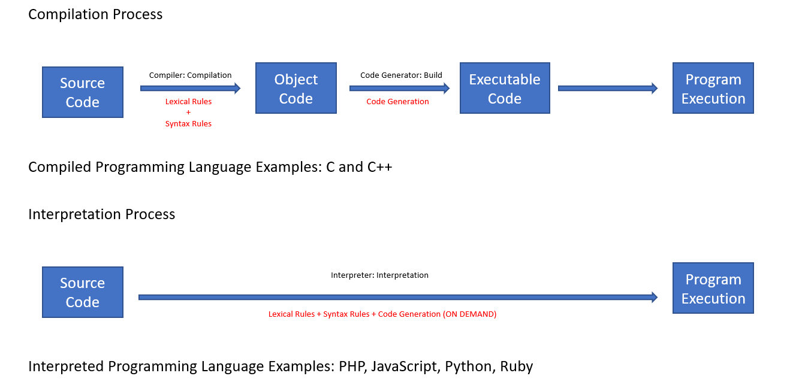
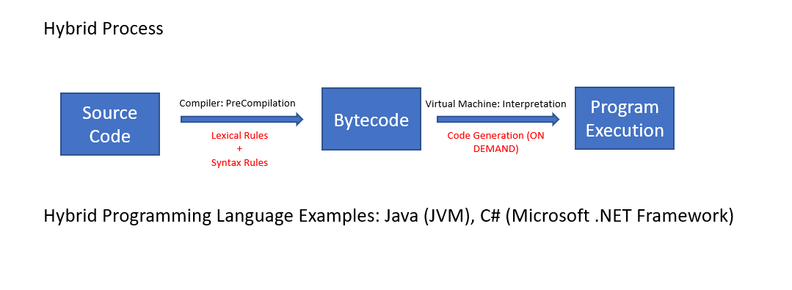
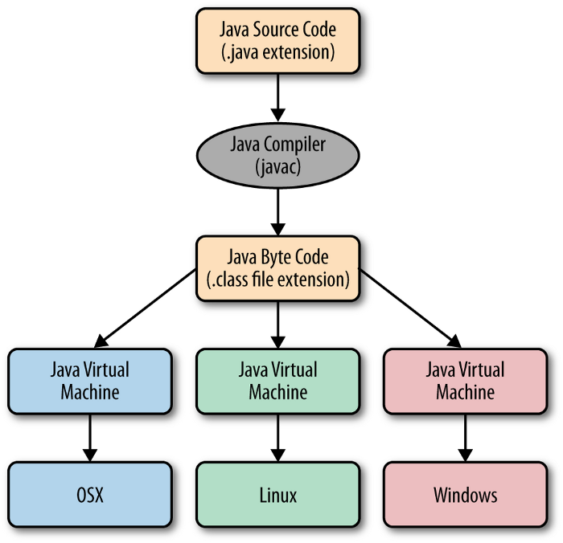
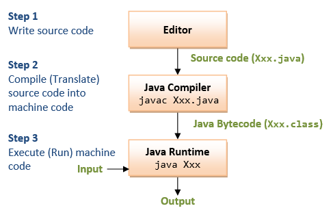
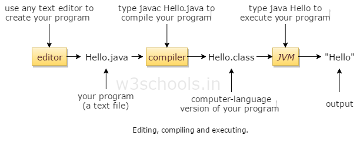
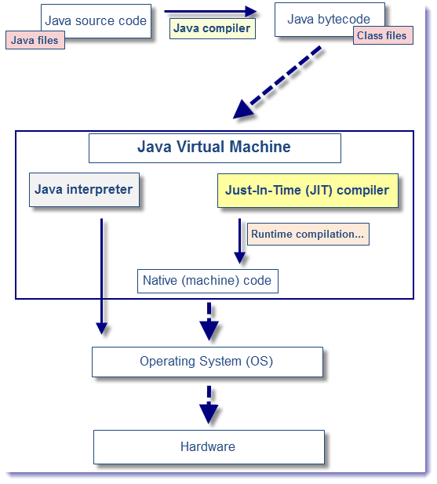
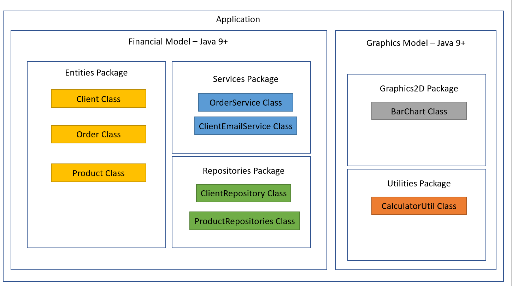
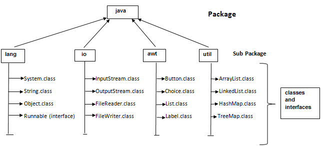

<h1 align="center"> Basic Template to Create Tutorials </h1>

# Content

1. [Project Status](#projectstatus)
2. [About the Project](#abouttheproject)
3. [Project Description](#projectdescription)
4. [Chapter 1: Programming Concepts](#chapter1)
    - [Chapter 1 - Part 1: Programmer's Career Starts](#chapter1part1)
    - [Chapter 1 - Part 2: Algorithm](#chapter1part2)
    - [Chapter 1 - Part 3: Automation](#chapter1part3)
    - [Chapter 1 - Part 4: Computer Program](#chapter1part4)
    - [Chapter 1 - Part 5: What Does it Take to Make a Computer Program?](#chapter1part5)
    - [Chapter 1 - Part 6: Programming Language](#chapter1part6)
    - [Chapter 1 - Part 7: IDE](#chapter1part7)
    - [Chapter 1 - Part 8: Compilation and Interpretation, Source Code and Object Code, Virtual machine](#chapter1part8)
5. [Chapter 2: Introduction to Java](#chapter2)
    - [Chapter 2 - Part 1: What is Java?](#chapter2part1)
    - [Chapter 2 - Part 2: Understanding Java Versions (LTS)](#chapter2part2)
    - [Chapter 2 - Part 3: JVM](#chapter2part3)
    - [Chapter 2 - Part 4: Compile-time Errors and Runtime Errors](#chapter2part4)
    - [Chapter 2 - Part 5: Structure of a Java Application](#chapter2part5)
    - [Chapter 2 - Part 6: Components of Oracle's Java Platform Products](#chapter2part6)
7. [Usage](#usage)
8. [Contributors](#contributors)
9. [Contributing](#contributing)
10. [Roadmap](#roadmap)
11. [To Do](#todo)
12. [Contacts](#contacts)
13. [License](#license)

# Project Status <a name="projectstatus"></a>

Project Status: Under Development :warning:

Project Status: Concluded :heavy_check_mark:

# About the Project <a name="abouttheproject"></a>

This project have a propose to introduce the reader to basic concepts in (put the theme her)

[![Project][project-shield]][project-url] <!-- Put the link of the github page of the tutorial her -->

# Project Description <a name="projectdescription"></a>

Lorem ipsum dolor sit amet, consectetur adipiscing elit. Integer accumsan id neque ut tempor. Nulla facilisi. Aliquam eu eros fermentum, commodo est sed, pharetra est. Curabitur
lacinia blandit turpis rhoncus varius. Proin vulputate orci nulla, nec porttitor nibh consequat in. Suspendisse ac neque ut massa commodo auctor in sed libero. Sed tincidunt
mauris eu tempor malesuada. Mauris feugiat vitae risus quis iaculis

Lorem ipsum dolor sit amet, consectetur adipiscing elit. Integer accumsan id neque ut tempor. Nulla facilisi. Aliquam eu eros fermentum, commodo est sed, pharetra est. Curabitur
lacinia blandit turpis rhoncus varius. Proin vulputate orci nulla, nec porttitor nibh consequat in. Suspendisse ac neque ut massa commodo auctor in sed libero. Sed tincidunt
mauris eu tempor malesuada. Mauris feugiat vitae risus quis iaculis
  
## <a name="chapter1"></a>Chapter 1: Programming Concepts

#### <a name="chapter1part1"></a>Chapter 1 - Part 1: Programmer's Career Starts

The beginning of any programmer's career starts with solid fundamentals, such as:

1. Programming Logic
2. Algorithms
3. Data Structure (Arrays, Lists)
4. Object Oriented Programming
5. Relational Data Base
6. Systems Analysis and Design

#### <a name="chapter1part2"></a>Chapter 1 - Part 2: Algorithm

Algorithm is a process or set of rules to be followed as problem-solving operations.

Make a cake problem:

A Cake Recipe Algorithm

1. Preheat the oven.
2. Gather the ingredients.
3. Measure out the ingredients.
4. Mix the ingredients to make the batter.
5. Grease a pan.
6. Pour the batter into the pan.
7. Put the pan in the oven.
8. Set a timer.
9. When the timer goes off, take the pan out of the oven.
10. Enjoy!

#### <a name="chapter1part3"></a>Chapter 1 - Part 3: Automation

Consists of using machine (s) to perform the procedure automatically or semi-automatically.

In the cake recipe example, a food mixer can in the step four can be a example of automation.

#### <a name="chapter1part4"></a>Chapter 1 - Part 4: Computer Program

Computer have:

Hardware: Physical Parts (CPU, RAM, GPU, keyboard...)

Software: Logical Part (Program)
    - Operation System
    - Aplications (Spotify, Word, Web Browser)
    - Games
    - Utilities

Conclusion: Computer programs are algorithms executed by the computer. The computer is a machine that automates the execution of
algorithms.
Any algorithm? No. Only computational algorithms: Data processing and Calculation

#### <a name="chapter1part5"></a>Chapter 1 - Part 5: What Does it Take to Make a Computer Program?

To make a computer program, we need:

- A programming language: lexical and syntactic rules for write the program
- An IDE: software to edit and test the program
- A compiler: software for turning source code into code object
- A code generator or virtual machine: software that allows the program to run

#### <a name="chapter1part6"></a>Chapter 1 - Part 6: Programming Language

Programming languages have a lexical rules (orthography) and syntax rules (grammar) to write programs.

- Lexical

    Is about the correct words orthography.
    
    | Example English                                 | Example Programming Language  |
    |:------------------------------------------------|:------------------------------|
    | Dog (Correct)                                   | Main (Correct)                |
    | Dogo (Wrong)                                    | Maim (Wrong)                  |
    
- Syntax

   Is about the correct sentence’s grammar.
   
    | Example English                                 | Example Programming Language       |
    |:------------------------------------------------|:-----------------------------------|
    | He is a Daniel in judgment (Correct)            | x = 2 + y (Correct)                |
    | Daniel is a He in judgment (Wrong)              | x = + 2 y (Wrong)                  |
    

Example of program in Java:

```java

package application;

import java.util.Scanner;

public class Program {

	public static void main(String[] args) {
		// TODO Auto-generated method stub
		
		Scanner sc = new Scanner(System.in);
        double x, y, media;
        
		System.out.print("Enter the First Number: ");
        x = sc.nextDouble();
        System.out.print("Enter the Second Number: ");
        y = sc.nextDouble();
        
        media = (x + y)/2.0;
        
        System.out.println("Media = " + media);
        sc.close();
	}

}

```

#### <a name="chapter1part7"></a>Chapter 1 - Part 7: IDE

It is a set of software used to build programs.

Ex:

- C / C ++: Code Blocks
- Java: Eclipse, NetBeans
- C#: Microsoft Visual Studio

Functions of an IDE

- Editing of source code (indentation, autocompletion, highlighting of words, etc.)
- Debugging and testing
- Construction of the final product (build)
- Suggestion of templates
- Assist in various tasks of your project

#### <a name="chapter1part8"></a>Chapter 1 - Part 8: Compilation and Interpretation, Source Code and Object Code, Virtual Machine

**Source Code**: is the code written by the programmer in a programming language

Ex:

```java

package application;

import java.util.Scanner;

public class Program {

	public static void main(String[] args) {
		// TODO Auto-generated method stub
		
		Scanner sc = new Scanner(System.in);
        double x, y, media;
        
		System.out.print("Enter the First Number: ");
        x = sc.nextDouble();
        System.out.print("Enter the Second Number: ");
        y = sc.nextDouble();
        
        media = (x + y)/2.0;
        
        System.out.println("Media = " + media);
        sc.close();
	}

}

```
<br>

<div align="center"><br><sub>Fig 1 - Compilation and Interpretation Process</sub></div>

<br>

<div align="center"><br><sub>Fig 2 - Hybrid Process</sub></div>

<br>

- **Compilation**:
	- Program Speed
	- Compiler Assistance Before Execution
	- Disadvantage: Platform dependence of the generated binary code

- **Interpretation**:
	- Flexibility of Maintaining the Application in Production
	- Expressiveness of Language
	- Source Code does not need to be Recompiled to run on different platform
	- Disadvantage: Execution speed compared to compiled languages.

- **Hybrid**:
	- Compiler Assistance Before Execution
	- Source Code does not need to be Recompiled to run on different platform

## <a name="chapter2"></a>Chapter 2: Introduction to Java

#### <a name="chapter2part1"></a>Chapter 2 - Part 1: What is Java?

**Whats is Java?** 

Java is a program language and a developing platform, with libraries (API) and execution environment.

When you need to run a Java Program in a computer, you have to install the execution environment to run the program and the JDK (Java Development Kit) with the libraries and API.

**History of Java**

- Problems solved and reason for its success:
	- Pointers (C and C++) / memory management (garbage collector)
	- Failed portability: writing part of the code when changing of SO
	- Use on miscellaneous devices
	- Costs

- Created by Sun Microsystems in the mid-1990s

- Acquired by Oracle Corporation in 2010

- Java Advantages:
	- Compiled code for bytecode and run on virtual machine (JVM)
	- Portable, safe, robust
	- Runs on various types of devices
	- Dominates the corporate market since the end of the 20th century

**Java Editions**

 - Java ME - Java Micro Edition - embedded and mobile devices - IoT - http://www.oracle.com/technetwork/java/javame
 - Java SE - Java Standard Edition - core - desktop e servers - http://www.oracle.com/technetwork/java/javase
 - Java EE - Java Enterprise Edition - corporate applications - http://www.oracle.com/technetwork/java/javaee

**Java SE Documentation**

https://docs.oracle.com/en/java/javase/11/


#### <a name="chapter2part2"></a>Chapter 2 - Part 2: Understanding Java Versions (LTS)

The Standard Edition (SE) of Java, you can see in this link: https://www.oracle.com/java/technologies/javase-downloads.html

It is absolutely crazy to think about keeping several applications or several hundred (thousand?) servers up to date with the newest Java release, especially when 5 have come out in as many years by the end of 2019. That is why the concept of an LTS was established. A Java LTS (long-term support) release is a version of Java that will remain the industry standard for several years. To give you an example of this, Java 8 was released in 2014, it will continue to receive updates until 2020, and extended support will end by 2025. This is a span of almost 10 years for a stable Java release to be considered an industry standard. This gives plenty of OS vendors like Microsoft and Red Hat the time to repackage their releases with Java 8, time for application developers to update their applications to take full advantage of Java 8 features, and time for system administrators to update their data centers with Java 8 before a new version is released. At this time, the only other Java version that is also an LTS version is Java 11, which was released in 2018.

#### <a name="chapter2part3"></a>Chapter 2 - Part 3: JVM

JVM is the Java Virtual Machine to execute Java Programs in your system.

Java take the advantages of compilation and interpretation and create the hybrid interpretation with JVM.

Below, there some of compilation process examples in Java:

<br>

<div align="center"><br><sub>Fig 3 - Compilation Process in Java - (<a href='https://medium.com/@PrayagBhakar/lesson-2-behind-the-scenes-4df6a461f31f'>Work by Prayag Bhakar</a>) </sub></div>

<br>

<div align="center"><br><sub>Fig 4 - Compilation Process in Java - (<a href='https://www3.ntu.edu.sg/home/ehchua/programming/java/J1a_Introduction.html'>Work by Chua Hock-Chuan</a>) </sub></div>

<br>

<div align="center"><br><sub>Fig 5 - Compilation Process in Java - (<a href='https://www.w3schools.in/java-tutorial/compile-java-file-using-javac/'>Work by  w3schools</a>) </sub></div>

<br>

The process to execute the bytecode is called JIT (Just in Time) Compilation. Is more faster than interpretation because the compiler revise before the run time, if the bytecode is lexical and syntactical correct.

<br>

<div align="center"><br><sub>Fig 6 - Compilation Process in Java - (<a href='http://javaeesupportpatterns.blogspot.com/2013/07/java-just-in-time-compilation-more-than.html'>Work by javaeesupportpatterns</a>) </sub></div>

<br>

#### <a name="chapter2part4"></a>Chapter 2 - Part 4: Compile-time Errors and Runtime Errors

| Compile-time                                                                                                              | Runtime                                                                                                                              | 
| :------------------------------------------------------------------------------------------------------------------------ | :-----------------------------------------------------------------------------------------------------------------------------------:|
| The compile-time errors are the errors which are produced at the compile-time, and they are detected by the compiler.     | The runtime errors are the errors which are not generated by the compiler and produce an unpredictable result at the execution time. |
| In this case, the compiler prevents the code from execution if it detects an error in the program.]                       | In this case, the compiler does not detect the error, so it cannot prevent the code from the execution.                              |
| It contains the syntax and semantic errors such as missing semicolon at the end of the statement.                         | It contains the errors such as division by zero, determining the square root of a negative number.                                   |

#### <a name="chapter2part5"></a>Chapter 2 - Part 5: Structure of a Java Application

Java is an object-oriented language and your base unit is the class.  Every Code in Java have to be in a class.

The classes is organize in packages and the packages is organize in modules. A Java application is a set of modules with packages.

Bellow, there is a example of a Java application:

<br>

<div align="center"><br><sub>Fig 7 - Application Structure in Java Application </sub></div>

<br>

#### <a name="chapter2part6"></a>Chapter 2 - Part 6: Components of Oracle's Java Platform Products

The Java JDK come with some of most used packages to help the developer like awt, beans, io, lang, math, net, nio, sql, util and each package have a class or a interface.

<br>

<div align="center"><br><sub>Fig 8 -Java Packages - (<a href='http://www.wellnwill.com/tutorial/core-java/package/package'>Work by Well N Will</a>) </sub></div>

<br>

Oracle have a documentation about all his packages: https://docs.oracle.com/javase/8/docs/technotes/guides/desc_jdk_structure.html

<br>

<div align="center"><br><sub>Fig 9 -Java Packages - (<a href='https://docs.oracle.com/javase/8/docs/technotes/guides/desc_jdk_structure.html'>Work by Oracle</a>) </sub></div>

<br>

One of the most famous used packages is java.util.collections and java.util.map

<div align="center"><br><sub>Fig 10 -Java Packages - (<a href='https://docs.oracle.com/javase/8/docs/technotes/guides/desc_jdk_structure.html'>Work by Oracle</a>) </sub></div>


# Usage <a name="usage"></a>

Use this space to show useful examples of how a project can be used. Additional screenshots, code examples and demos work well in this space. You may also link to more
resources.

_For more examples, please refer to the [Documentation](https://example.com)_

# Contributors <a name="contributors"></a>

| [ <br> <sub> Vitor Garcia </sub>][github-url] | 
| :-----------------------------------------------------------------------------------------------------: |

# Contributing <a name="contributing"></a>

Contributions are what make the open source community such an amazing place to be learn, inspire, and create. Any contributions you make are **greatly appreciated**.

1. Fork the Project
2. Create your Feature Branch (`git checkout -b feature/AmazingFeature`)
3. Commit your Changes (`git commit -m 'Add some AmazingFeature'`)
4. Push to the Branch (`git push origin feature/AmazingFeature`)
5. Open a Pull Request

# Roadmap <a name="roadmap"></a>

See the [![Issues][issues-shield]][issues-url]  for a list of proposed features (and known issues).

# To Do <a name="todo"></a>

If so, list tasks / features that still need to be implemented in your application

:memo: To Do 1 

:memo: To Do 2

:memo: To Do 3 


# Contacts <a name="contacts"></a>

| Vitor Garcia                                     | Column 2                                   | Column 3     |
| :----------------------------------------------- | :-----------------------------------------:| -----------: |
| [![LinkedIn][linkedin-shield]][linkedin-url]     | More Stuff                                 | And Again    |
| [![Portfolio][portfolio-shield]][portfolio-url]  | Put Pipes In                               | Like this    |
| [![GitHub][github-shield]][github-url]           | Put Pipes In                               | Like this    |

# License <a name="License"></a>

- [![MIT License][license-shield]][license-url]

- Distributed under the MIT License. See `LICENSE` for more information.


<!-- README TUTORIALS -->

<!--

https://dev.to/reginadiana/como-escrever-um-readme-md-sensacional-no-github-4509

-->

<!-- 

Mark Down Guide - Readme Text Format Style

https://www.markdownguide.org/

-->

<!-- 

How to Create your Badges

https://gist.github.com/rupeshtiwari/8558ca0d8ec1c15619e4492dcd6aa81a

-->

<!-- USEFUL LINKS -->

<!--

Free Images Without Copyright

https://unsplash.com/


-->

<!-- MY BADGES -->

[project-shield]: https://img.shields.io/badge/link-project-green.svg
[project-url]: https://github.com/vitorstabile/tutorial-template-readme
[linkedin-shield]: https://img.shields.io/badge/my-linkedin-blue.svg 
[linkedin-url]: https://www.linkedin.com/in/vitor-stabile-garcia-5b151b67
[portfolio-shield]: https://img.shields.io/badge/my-portfolio-red.svg
[portfolio-url]: https://vitorstabile.github.io
[github-shield]: https://img.shields.io/badge/my-github-green.svg
[github-url]: https://github.com/vitorstabile
[issues-shield]: https://img.shields.io/badge/link-issues-green.svg
[issues-url]: https://github.com/vitorstabile/tutorial-template-readme/issues
[license-shield]: https://img.shields.io/badge/license-mit-blue.svg 
[license-url]: https://github.com/vitorstabile/tutorial-template-readme/blob/main/LICENSE.txt
